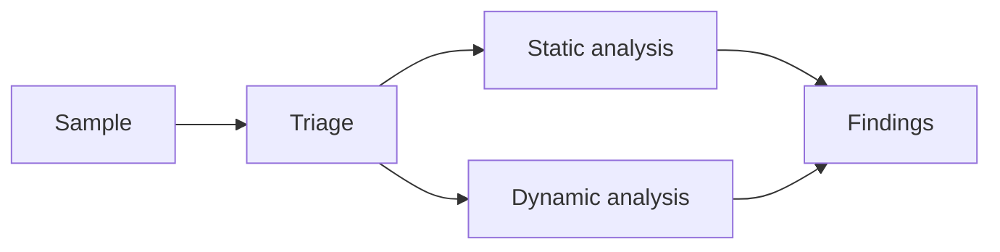

# BinRev

Malware analysis and reverse-engineering notes.

This site is a growing collection of practical research covering static analysis,
dynamic analysis, reverse engineering, and the techniques used by malicious software.

