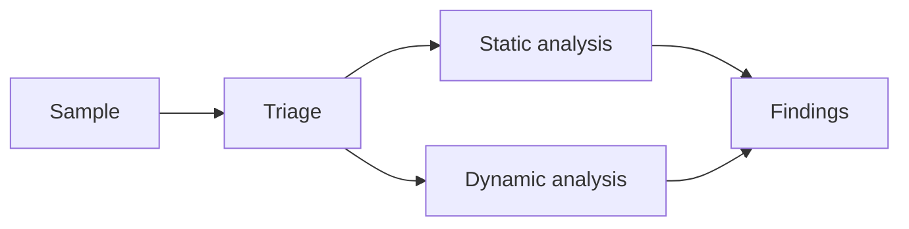

# BinRev
Malware analysis and reversing notes.

# 1 - Resources
# 2 - Analyzed Samples
- [[IcedID]]
- [[Zloader]]

```mermaid
flowchart LR
    Sample --> Triage
    Triage --> Static[Static analysis]
    Triage --> Dynamic[Dynamic analysis]
    Static --> Findings
    Dynamic --> Findings
```
